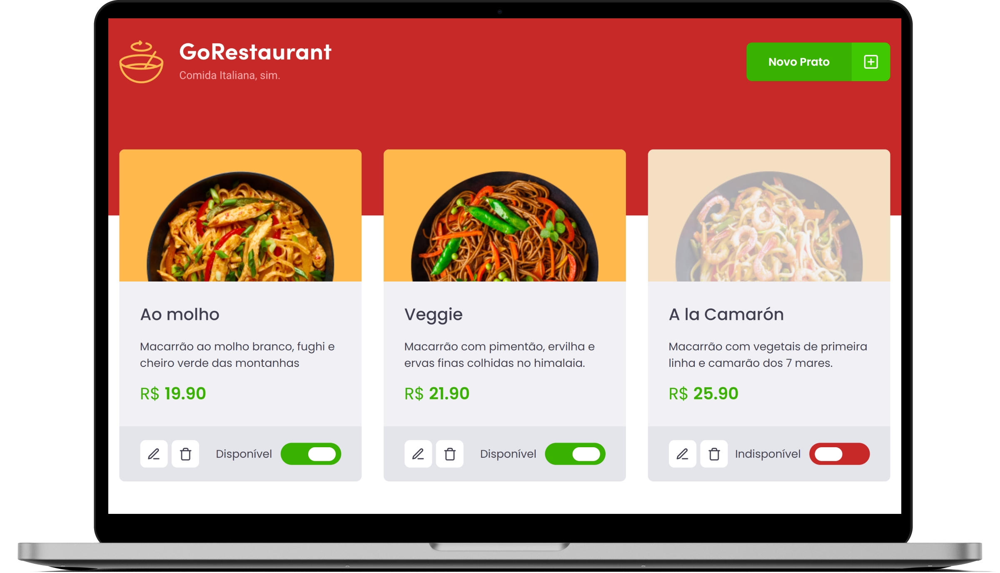

<h1 align="center">
  </img>
</h1>

<p align="center">
  <a href="#ℹ-descrição">Descrição</a> •
  <a href="#-tecnologias">Tecnologias</a> •
  <a href="#-pré-requisitos">Pré-requisitos</a> •
  <a href="#-como-usar">Como usar</a> •
  <a href="#-demonstração">Demonstração</a>
</p>

<p align="center">
  </img>
</p>

## ℹ Descrição

Projeto desenvolvido como desafio complementar do capítulo 2 do Ignite. 👨‍🚀🚀

O desafio consistia em realizar dois processos de migração: de _Javascript_ para _Typescript_ e de _Class Components_ para _Function Components_.

GoRestaurant é uma aplicação para administrar produtos de um restaurante italiano. A principal funcionalidade do projeto é o **CRUD** de produtos através do _Axios_ e _JSON Server_:

- Get: retorna todos os produtos e o front end lê;
- Post: adiciona novo produto com dados do modal;
- Put: alterna a disponibilidade do produto pelo id;
- Delete: deleta o produto pelo id.

## ⚒ Tecnologias

- [**React**](https://pt-br.reactjs.org)
- [**Typescript**](https://www.typescriptlang.org)
- [**styled-components**](https://www.styled-components.com/)
- [**yup**](https://github.com/jquense/yup)
- [**unform**](https://unform.dev/)
- [**React Modal**](https://github.com/reactjs/react-modal)
- [**react-router-dom v5**](https://v5.reactrouter.com/web/guides/quick-start)
- [**React-Icons**](https://react-icons.github.io/react-icons/)
- [**Axios**](https://axios-http.com/)
- [**JSON Server**](https://github.com/typicode/json-server)

## ⚙ Pré-requisitos

- [Git](https://git-scm.com)
- [Yarn](https://yarnpkg.com)
- Editor de código.

## 🖥 Como usar

**Clone o projeto e acesse a pasta**

```bash
$ git clone https://github.com/EduardoReisUX/GoRestaurant && cd GoRestaurant
```

**Siga os passos seguintes**

```bash
# Instale as dependências
$ yarn

# Inicie o servidor
$ yarn server

# Rode a aplicação
$ yarn start
```

## 👀 Demonstração

<p align="center">
</img>
</p>

---

<p align="center">Feito com 💜 por <a href="https://github.com/EduardoReisUX">Eduardo dos Reis</a></p>
